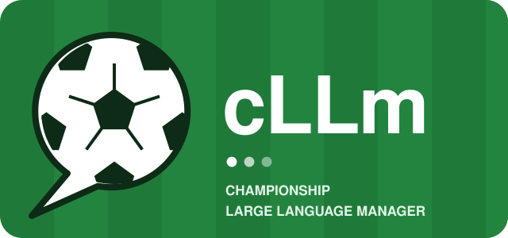

<div align="center">



[](https://www.gnu.org/licenses/gpl-3.0)
[](https://www.rust-lang.org/)
[](https://tauri.app/)
[](https://react.dev/)
[](https://github.com/hani-q/cLLm/commits/main)

[Features](#features) • [The CM 01/02 database](#the-cm-0102-database) • [Installation](#installation--development) • [Contributing](#contributing) • [License](#license)

</div>

---

**cLLm** is a free and open source football management game in the spirit of Championship
Manager 01/02: text match commentary, deep squad and transfer management, and the 2001/02 season
as the starting world. The long-term goal is to use large language models, including local
models, in every part of the game: commentary, press conferences, the board, rival managers and
the players themselves.

cLLm is a fork of [Openfoot Manager](https://github.com/openfootmanager/openfootmanager) by
Pedrenrique G. Guimarães and contributors. Everything in this repository today comes from that
project. Changes that would help Openfoot Manager as well belong upstream first.

## STATUS

Just forked. The game currently plays exactly like Openfoot Manager. Planned work, in order:

1. An importer that reads the original CM 01/02 database from your own copy of the game.
2. A match engine interface, so engines from other open source projects can be compared and swapped.
3. LLM layers on top of the match event stream and the built-in MCP server.

## FEATURES

Inherited from Openfoot Manager:

- **Text-based match simulation** with event-driven commentary and score progression.
- **Full squad management** for roles, depth planning, and player development decisions.
- **Transfer and contract workflows** to buy, sell, and negotiate player moves.
- **Training and staff systems** to improve performance through coaching and planning.
- **Dynamic inbox and news generation** that keeps you updated on club and world events.
- **Scouting support** for discovering talent and evaluating future signings.
- **Persistent game data** backed by SQLite for local saves and progression.
- **MCP server** (`--features mcp`) that lets an AI agent play the game.
- **Multi-language support** with i18n foundations.

## THE CM 01/02 DATABASE

cLLm starts in the 2001/02 season, using the Championship Manager 01/02 database. **cLLm does
not include that database and never will.** The game reads it from your own copy of
Championship Manager 01/02, which Eidos released as a free download in December 2008.

Keep your copy outside this repository. Never commit `.dat` files.

## SCREENSHOTS

Screenshots from Openfoot Manager, which cLLm currently matches. Click any image to open the
full-size version.

<a href="images/screenshots/inbox.png"></a>
<a href="images/screenshots/news.png"></a>
<a href="images/screenshots/manage_squad.png"></a>

<a href="images/screenshots/matchlive.png"></a>
<a href="images/screenshots/training.png"></a>
<a href="images/screenshots/playertalk.png"></a>

<a href="images/screenshots/presstalk.png"></a>

## ARCHITECTURE

- **Rust**: match simulation engine and game state.
- **Tauri**: lightweight desktop application shell.
- **React + TypeScript + TailwindCSS**: the frontend.
- **SQLite**: local persistence for game saves.

The internal crate names (`ofm_core`, `ofm-cli` and so on) and the `.ofm` package format keep
their upstream names so that merging from Openfoot Manager stays simple.

## INSTALLATION & DEVELOPMENT

To build and run the debug version, install the standard tools for Rust, Node and Tauri
development:

1. Install **Rust** (via `rustup`)
2. Install **Node.js** (v18+)
3. Install Tauri dependencies for your specific OS (see the [Tauri Prerequisites Guide](https://v2.tauri.app/start/prerequisites/))

Clone the repository and install dependencies:

```bash
git clone https://github.com/hani-q/cLLm.git
cd cLLm
npm install
```

Run the development desktop app:

```bash
npm run tauri dev
```

### Linux graphics

Linux renders through WebKitGTK, which has known trouble with NVIDIA's proprietary driver. The
app detects your GPUs at startup and picks a rendering path automatically; if you get a blank
window or a sluggish UI, [docs/LINUX_GRAPHICS.md](docs/LINUX_GRAPHICS.md) explains the
`OFM_GPU_PROFILE` override and records the measurements behind the default.

### Following upstream

```bash
git remote add upstream https://github.com/openfootmanager/openfootmanager.git
git fetch upstream
git merge upstream/develop
```

## CONTRIBUTING

Issues and pull requests are welcome at [hani-q/cLLm](https://github.com/hani-q/cLLm). Work from
a feature branch and open pull requests against `main`. [AGENTS.md](AGENTS.md) and
[CONTRIBUTING](CONTRIBUTING.md) describe the coding rules, which cLLm keeps from upstream.

Run tests before submitting:

```bash
npm test
cd src-tauri
cargo test --workspace
```

## LICENSE

    cLLm - Championship Large Language Manager
    A modified version of Openfoot Manager.

    Openfoot Manager - A free and open source soccer management game
    Copyright (C) 2020-2026  Pedrenrique G. Guimarães

    This program is free software: you can redistribute it and/or modify
    it under the terms of the GNU General Public License as published by
    the Free Software Foundation, either version 3 of the License, or
    (at your option) any later version.
    This program is distributed in the hope that it will be useful,
    but WITHOUT ANY WARRANTY; without even the implied warranty of
    MERCHANTABILITY or FITNESS FOR A PARTICULAR PURPOSE.  See the
    GNU General Public License for more details.

    You should have received a copy of the GNU General Public License
    along with this program.  If not, see <http://www.gnu.org/licenses/>.

Check [LICENSE](LICENSE.md) for more information.

Championship Manager is a trademark of its respective owner. cLLm is not affiliated with or
endorsed by Sports Interactive, SEGA or Eidos.
